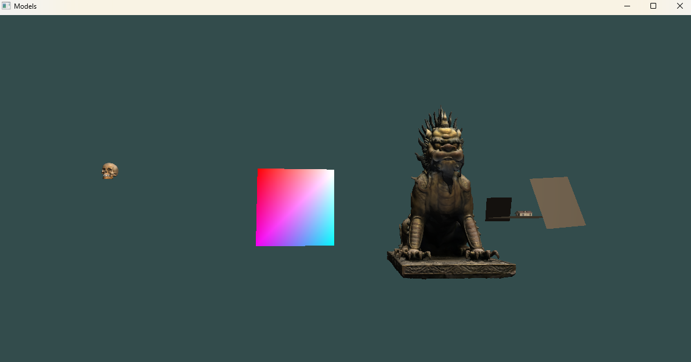
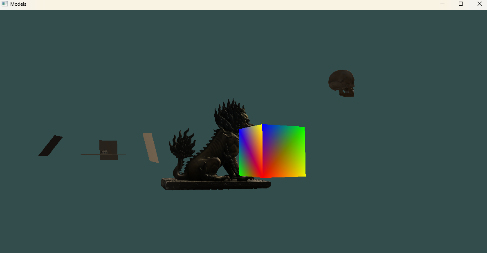

# Scene_model

## Project Description
`scene_model` is a C++ OpenGL project for rendering 3D models with custom shaders. The project demonstrates loading OBJ models, applying vertex and fragment shaders, and basic scene transformations.

## Features
- Load and render 3D OBJ models
- Load and render Lambert lighting
- Apply vertex and fragment shaders
- Transform models with translation, rotation, and scaling
- Basic camera control

## Requirements
- C++ compiler (supporting C++14 or later)
- OpenGL 3.3 or higher
- GLFW
- GLAD
- GLM
- CMake (optional, if using a build system)

## Project Structure
```
scene_model/
  shaders/
    shader.vert
    shader.frag
  models/
    cottage/
      cottage.obj
      cottage.mtl
      texture.png
    qilin/
      qilin.obj
      qilin.mtl
      texture.png
    skull/
      skull.obj
      skull.mtl
      texture.png
  include/
    camera.h
    input_handler.h
    model.h
    stb_image.h
  src/
    main.cpp
    camera.cpp
    input_handler.cpp
    model.cpp
```


## Libraries need link to vs22

- GLEW
- GLFW
- GLM
- TINYOBJLOADER

In GOOGLE link you can download external  link folder and paste in here, 
it will work.


Links:
- [GOOGLE](https://drive.google.com/drive/folders/1a8rKdl8snLjJzEX8frAjxcgdycflZZFF?usp=sharing)
- [GLEW](https://sourceforge.net/projects/glew/)
- [GLFW](https://www.glfw.org/documentation.html)
- [GLM](https://github.com/g-truc/glm/releases/tag/1.0.2)
- [TINYOBJLOADER](https://github.com/tinyobjloader/tinyobjloader/releases/tag/v1.0.6)

## Screenshot of light and shadow



### Youtube video 
<a href="https://youtu.be/TD-t1uKz9H0" target="_blank">▶️ Watch on YouTube</a>


## How to link external libraries


This guide explains how to link **header-only** and **compiled libraries** in Visual Studio 2022 for your project.

## 1. Lib Libraries 

1. Link GLEW `lib` folder, for example:
```
  GLEW/
      lib/
         Release/
                x64/
                   
```
2.  Link GLEW `include` folder, for example:
```
  GLEW/
      include/
```      
3. Link GLFW `include` folder, for example:
```
  GLFW/
      include/
```
4. Link GLFW lib folder `lib-vc2022`, for example: 
```
  GLFW/
      lib-vc2022
```
5. Link GLM folder itself, for example:
```
  GLM/.
```
6. Link TINYOBJLOADER folder iself it will work, for example:
```
  TINYOBJLOADER/.
```
After linking all this, after you can build a project. 

---

It has `stb_image.h` single-file in Header folder, it is a header-only library for loading images in C and C++ projects.

Now it is in header, but you have to download it in other project.

---

Last, if you want to use Debug, you have to copy glew32.dll in x64/Debug/.

Thanks

Copyright Sony


